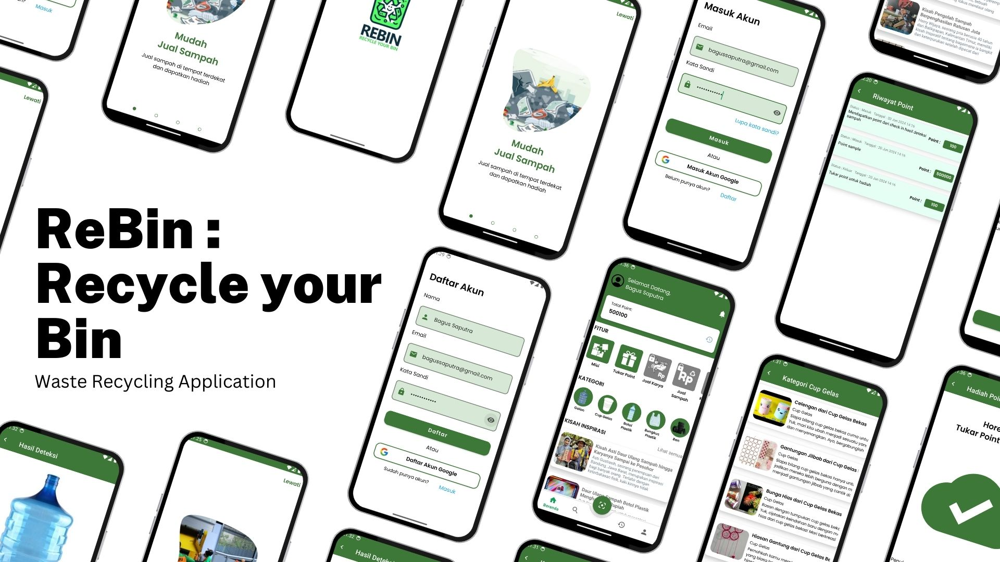

## 🌱 Hello Eco-Friends! Let's bin it right 🗑️ and recycle smart! ♻️

# ReBin: Recycle Your Bin

This application was developed by Team C241-PS016 as part of the Bangkit Academy 2024 Batch 1 Capstone Project.  
  

## Description

ReBin: Recycle Your Bin, aims to address waste management challenges in Indonesia by offering real-time waste classification. This feature enables accurate identification and categorization of waste items into 10 different categories, thereby promoting efficient recycling and sustainable practices. Additionally, ReBin provides educational resources to users, raising awareness about the significance of proper waste disposal and recycling. Through tips, tutorials, and interactive content, the app educates the community on adopting sustainable practices.

## Our Team

| No  | Member ID    | Name                       | Institution                             | Learning Path           | 
|-----|--------------|----------------------------|-----------------------------------------|-------------------------|
| 1   | M124D4KX1516 | Kartika Deviani            | Politeknik Harapan Bersama              | Machine Learning        | 
| 2   | M232D4KY2952 | Patrick Ulysses            | Universitas Katolik Parahyangan         | Machine Learning        |
| 3   | M232D4KX2774 | Sherrine Tania             | Universitas Katolik Parahyangan         | Machine Learning        | 
| 4   | C299D4KX0723 | Mutia Istiqomah            | Universitas Pendidikan Indonesia        | Cloud Computing         | 
| 5   | C299D4KX0532 | Ghalda Azzahra Dwitami     | Universitas Pendidikan Indonesia        | Cloud Computing         | 
| 6   | A124D4KY4222 | Avriansyah Bahtiar         | Politeknik Harapan Bersama              | Mobile Development      | 
| 7   | A132D4KY4274 | Orry Frasetyo              | Politeknik Negeri Padang                | Mobile Development      | 

## Repository

1. [Machine Learning](https://github.com/ReBin-Recyle-Your-Bin/ReBin-MachineLearning-ModelandAPI)
2. [Mobile Development](https://github.com/ReBin-Recyle-Your-Bin/ReBin-MobileApps)
3. [Cloud Computing](https://github.com/ReBin-Recyle-Your-Bin/ReBin-BackEnd)
